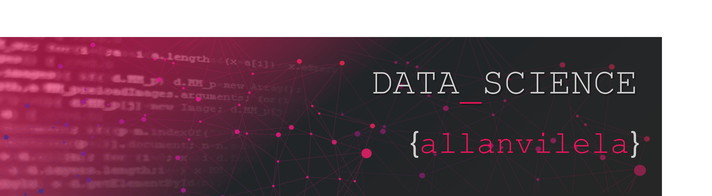

   

  

# Allan Vilela
*Engº de Produção e de Qualidade, Consultor de BI e futuro Cientista de Dados

Engenheiro com 11 anos de experiência na Indústria Automotiva e na Qualidade. Entusiasta de Tecnologia de Informação e Storytelling com Dados, sempre aplicou na Indústria conceitos e ferramentas de Análises de Dados, Lean Manufacturing, Six Sigma, Metodologias de Solução de Problemas, BI e etc. para otimizar processos e suportar as decisões baseadas em fatos e dados.

Após anos atuando nas áreas de negócio, sua "paixão pelos dados" o levou a buscar redirecionar sua carreira para a Área de Dados (BI e Data Science). Assim, aliando-se a
experiência e resiliência de um veterano com a motivação e entusiasmo de um novato para maximizar resultados!

**Background in:** VBA, Excel, Minitab, Python, Power BI, SQL

**Links:**
* [LinkedIn](https://www.linkedin.com/in/allanvileladashs/)
* [Medium](https://www.medium.com)

## Projetos:
Projetos em Construção:

* **Classificação de Perfil de Investidor a partir da aplicação do algoritmo KNN: **
* **Escrita em Libras a partir de visão Computacional: **

---

